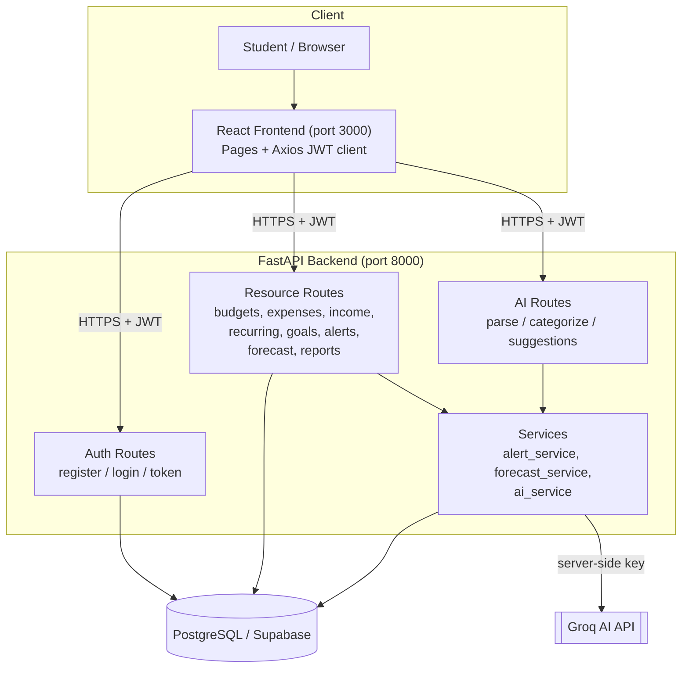

# Architecture — Ship It

Ship It is a classic three-tier web application — a React single-page app, a FastAPI backend, and a PostgreSQL database — with an external Groq AI service called only from the backend.

## System Overview

## Components

- **React Frontend (port 3000)** — pages for Login/Register, Dashboard, Budget, Expenses, Goals, and Reports. An Axios client attaches the JWT from `localStorage` to every request and redirects to login on a 401.
- **FastAPI Backend (port 8000)** — organized into auth routes, resource routes, AI routes, and service modules:
  - **Auth routes** issue and validate JWTs.
  - **Resource routes** handle CRUD for budgets, categories, expenses, income, recurring expenses, saving goals, alerts, forecasts, and reports.
  - **AI routes** wrap the AI service for parsing, categorization, and suggestions.
  - **Services** contain reusable logic: `alert_service` (threshold checks), `forecast_service` (projection math), and `ai_service` (Groq calls).
- **PostgreSQL (Supabase)** — persistent storage; tables auto-created on startup. UUID primary keys throughout.
- **Groq AI API** — external LLM service, reached only from the backend using the server-side `GROQ_API_KEY`.

## Request flow — Adding an expense

1. The student fills in the Add Expense form (category, amount, description) in the React UI and clicks Save.
2. Axios sends `POST /expenses` with the JSON body and an `Authorization: Bearer <token>` header.
3. FastAPI validates the JWT, resolves the current user, and validates the request body with Pydantic.
4. The backend writes the new expense to PostgreSQL, scoped to that user's `user_id`.
5. The **alert service** checks whether the expense pushed the category past its 80% or 100% threshold and creates an alert if so.
6. The API returns the saved expense; the frontend refreshes the list and the dashboard reflects updated spending and any new alert.

## Security

- **Authentication required** — all routes except `/auth/register`, `/auth/login`, and `/auth/token` require a valid JWT.
- **Per-user data isolation** — every database query is filtered by the authenticated user's `user_id`, so users can only read or modify their own data.
- **Secrets in environment variables** — `SECRET_KEY`, `DATABASE_URL`, and `GROQ_API_KEY` live in `backend/.env` and are never committed or sent to the client. The Groq key is used exclusively server-side.
- **Password security** — passwords are hashed with bcrypt; only the hash is stored.
