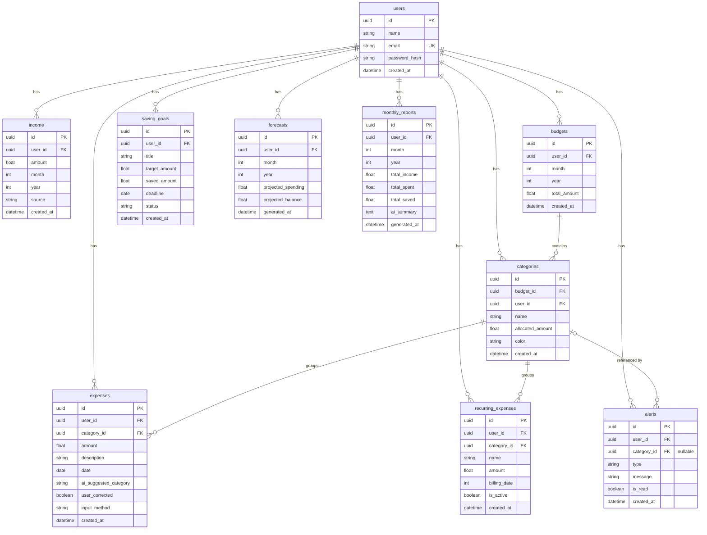

# Database ERD — PocketAI

The database has **10 tables**. All primary keys are **UUIDs**. Every user-owned table carries a `user_id` foreign key so data can be isolated per user.

## Relationships

- **`users`** has many of everything — income, budgets, categories, expenses, recurring expenses, saving goals, alerts, forecasts, and monthly reports.
- **`budgets`** contains many **`categories`**.
- **`categories`** groups many **`expenses`** and many **`recurring_expenses`**.
- **`categories`** may be referenced by **`alerts`** (the `category_id` on an alert is **nullable** — some alerts are not tied to a specific category).

## Notes — Per-user data isolation

Every user-owned table includes a `user_id` foreign key referencing `users.id`. The backend filters **every** query by the authenticated user's id, so a user can only ever read or modify their own rows. Combined with UUID primary keys (which are non-sequential and non-guessable), this enforces strict per-user data isolation across the entire schema.
